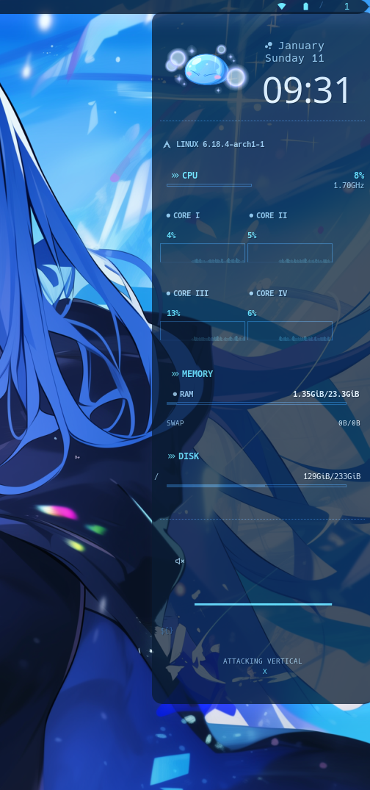

# [[ ✧ ˚₊ ‧✩ ੈ DOTS BY DIZZY  ੈ✩‧₊˚ ✧ ]]
Conky Sidebar w/ a blue glass theme

A sidebar made with Conky that displays processes as a widget

Contains an image beside the date and time, your Linux distro, CPU processes, Memory, Disc space, and a Cava music player at the bottom that displays jumping bars with music. 
(I am using pulseaudio with pipewire, please config to your own music player if necessary)

This widget stays on right side of screen unless you kill it manually in terminal 

( killall conky )

or configure your own position. (top-left, top-right, center, etc.)

**CONKY WIKI**

[Conky Wiki](https://wiki.archlinux.org/title/Conky)

**CONKY.CC**

[Conky Webpage](https://conky.cc/)

**GITHUB CONKY**

[GitHub Conky Wiki](https://github.com/brndnmtthws/conky/wiki)

**GITHUB CAVA MUSIC VISUALIZER**

[Cava Github](https://github.com/karlstav/cava)

_Required_

:light_blue_heart: Conky

:light_blue_heart: Cava

:light_blue_heart: Nerd Fonts (Hack) & Roboto font

:light_blue_heart: Pulseaudio

:light_blue_heart: Pipewire

[ I am using Linux Archcraft & i3wm ]
